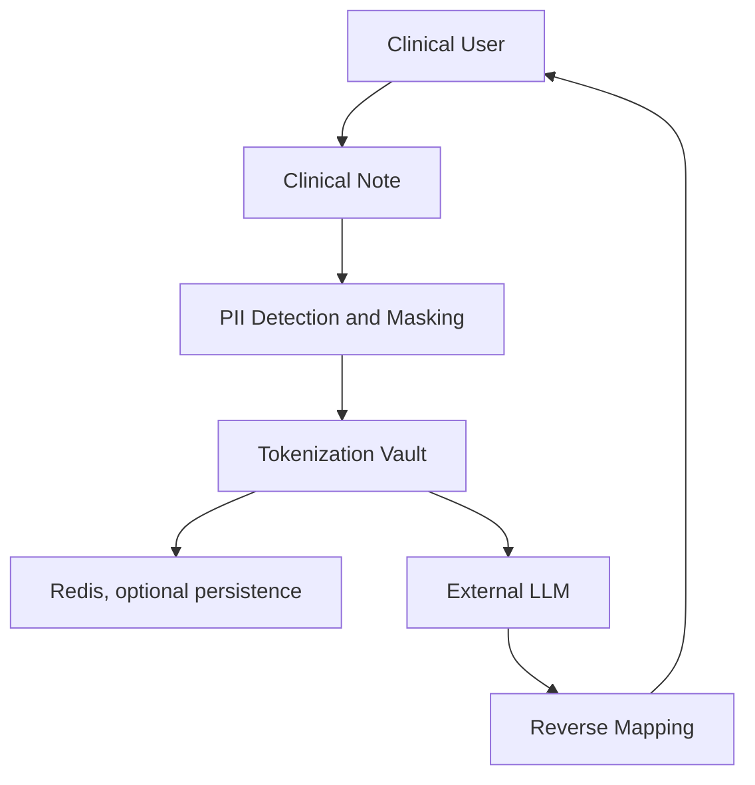

# Tokenization and Pseudonymization Architecture

## Overview

This project uses reversible pseudonymization rather than permanent redaction for sensitive values found in clinical notes. The goal is to protect PHI/PII before text is sent to an external LLM while still allowing the original values to be restored for the clinical user.

The implementation is centered on the tokenization vault in [../vault/tokenization.py](../vault/tokenization.py), with Redis-backed persistence in [../vault/redis_client.py](../vault/redis_client.py), reverse lookup in [../vault/reverse_mapping.py](../vault/reverse_mapping.py), preprocessing in [../proxy/app/services/redaction.py](../proxy/app/services/redaction.py), and the request flow in [../proxy/app/routes/proxy.py](../proxy/app/routes/proxy.py).

## Why pseudonymization is used

Permanent redaction would remove the original values and make downstream responses less useful for the clinical user. In this implementation, the proxy replaces sensitive content with deterministic, session-scoped tokens so the LLM can still reason about the text structure while the original values remain recoverable.

This design supports:

- privacy protection before outbound requests
- reversible restoration after the LLM responds
- deterministic token reuse inside a session
- an optional Redis layer for cross-process persistence

## High-level system architecture



## Components

### 1. Redaction service

The preprocessing layer in [../proxy/app/services/redaction.py](../proxy/app/services/redaction.py) applies two stages of masking:

- regex-based masking for structured values such as emails, phone numbers, dates, and address-style strings
- NLP-based masking for person and location entities using spaCy

Each detected value is replaced with a token from the tokenization vault.

### 2. Tokenization vault

The vault in [../vault/tokenization.py](../vault/tokenization.py) is a session-scoped reversible pseudonymization engine. It maintains in-memory mappings between:

- (entity type, original value) -> token
- token -> original value

It also supports deterministic token reuse for the same entity/value during the same session.

### 3. Redis storage helpers

The Redis integration in [../vault/redis_client.py](../vault/redis_client.py) is optional. When configured, it stores mappings for reuse across processes and supports deterministic counters.

### 4. Reverse mapping

The reverse mapping layer in [../vault/reverse_mapping.py](../vault/reverse_mapping.py) scans the LLM response for known pseudonym tokens and restores the original values before the response is returned to the user.

## Data flow through the application

1. A clinical note is submitted to the proxy endpoint in [../proxy/app/routes/proxy.py](../proxy/app/routes/proxy.py).
2. The request is passed to the redaction service.
3. The redaction service detects PHI/PII and asks the tokenization vault for a token.
4. The vault creates a new token if none exists, or reuses an existing one for the same value.
5. The pseudonymized note is sent to the external LLM.
6. The LLM returns a response that may contain the pseudonym tokens.
7. The proxy route calls reverse mapping to restore tokens to their original values.
8. The restored response is returned to the clinical user.

## Token generation process

Tokens follow the implementation format:

- {entity_type}_{count:04d}

Examples:

- PERSON_0001
- EMAIL_0001
- PHONE_0001

The vault normalizes entity types into a safe uppercase prefix by replacing non-alphanumeric characters with underscores. If the normalized value is empty, it defaults to UNKNOWN.

The generation logic is:

1. Check in-memory mappings for an existing token.
2. If Redis is available, try to reuse a token from Redis.
3. Otherwise, create a new token using the entity-specific counter.
4. If the token already exists in memory, increment the counter until a unique token is produced.

## Deterministic mapping within a session

The vault is deterministic within the current session. If the same value is seen again for the same entity type, the same token is returned. This behavior is enforced by the vault's internal dictionaries and the Redis-backed lookup path when Redis is reachable.

The same session also supports reverse lookup for previously generated tokens. When the session is reset, the in-memory mappings are cleared.

## Reverse mapping process

The reverse mapping function in [../vault/reverse_mapping.py](../vault/reverse_mapping.py) uses a regular expression to detect tokens that match the implementation pattern. For each detected token:

- it checks the in-memory cache first
- it calls the vault's detokenization function
- if a mapping exists, it replaces the token with the original value
- if no mapping exists, it leaves the token unchanged

This makes reverse mapping safe and non-blocking even when a token is unknown.

## Redis storage

Redis is used only as an optional persistence layer. The keys created by [../vault/redis_client.py](../vault/redis_client.py) follow this structure:

- vault:original:{entity_type}:{sha256(original_value)}
- vault:token:{token}
- vault:counter:{entity_type}

The Redis connection is created only when the environment variables are present:

- REDIS_HOST
- REDIS_PORT
- REDIS_DB
- REDIS_PASSWORD

If the configuration is incomplete or the connection fails, the vault logs a warning and falls back to in-memory storage.

## In-memory fallback behavior

The vault does not require Redis to operate. When Redis is unavailable, it continues to function using only the in-memory dictionaries. This makes the service usable in local development and in environments where Redis is not configured.

The fallback behavior is intentionally simple:

- Redis lookup is attempted only once per vault instance unless it becomes available later
- failures are treated as temporary and logged as warnings
- the vault continues to generate and resolve tokens in memory

## Error handling strategy

The implementation handles failures conservatively:

- Redis connection errors are caught and logged
- the vault disables Redis for the current instance after a failed attempt and falls back to memory
- unknown tokens are left unchanged during reverse mapping rather than causing the request to fail
- the proxy route still returns a response even when some tokens cannot be resolved

## Security considerations

The current implementation is designed to provide reversible privacy protection, not cryptographic anonymity. The following considerations apply:

- tokens are readable pseudonyms rather than opaque random identifiers
- mappings are session-scoped and should be treated as sensitive metadata
- raw note content should not be logged at INFO level or above
- Redis should be protected with network access controls and environment-based credentials

## Current limitations

The current implementation has several important limitations:

- tokenization is session-scoped and not a long-term data protection mechanism
- reverse mapping depends on the vault having seen the token during the active session
- Redis persistence is optional and not designed as a full replacement for a managed secret store
- entity detection is heuristic and may still produce false positives or false negatives
- the reverse mapping regex only targets tokens that match the implementation pattern

## Future improvements

Possible follow-up work includes:

- introducing explicit session identifiers and scoped lifecycle management
- improving the token format to reduce guessability
- adding stronger access controls and audit logging around token mappings
- expanding entity detection quality and reducing false positives
- supporting explicit expiration or rotation policies for vault data

## Example flow

### Original note

Patient Jane Doe called from 555-555-1234 and emailed jane@example.com.

### Pseudonymized note

Patient PERSON_0001 called from PHONE_0001 and emailed EMAIL_0001.

### Mock LLM response

Summary: Patient PERSON_0001 called from PHONE_0001 and emailed EMAIL_0001.

### Restored final response

Summary: Patient Jane Doe called from 555-555-1234 and emailed jane@example.com.

## Sequence diagram

```mermaid
sequenceDiagram
    participant User as Clinical User
    participant Note as Clinical Note
    participant Redactor as PII Detection
    participant Vault as Tokenization Vault
    participant Redis as Redis (optional)
    participant LLM as External LLM
    participant Mapper as Reverse Mapping

    User->>Note: Submit clinical note
    Note->>Redactor: Raw note content
    Redactor->>Vault: Request tokens for detected values
    Vault->>Redis: Lookup or persist mapping (if configured)
    Redis-->>Vault: Existing mapping or counter update
    Vault-->>Redactor: Pseudonymized tokens
    Redactor-->>LLM: Pseudonymized note
    LLM-->>Mapper: Response containing tokens
    Mapper->>Vault: Resolve original values
    Vault-->>Mapper: Restored values
    Mapper-->>User: Final restored response
```
